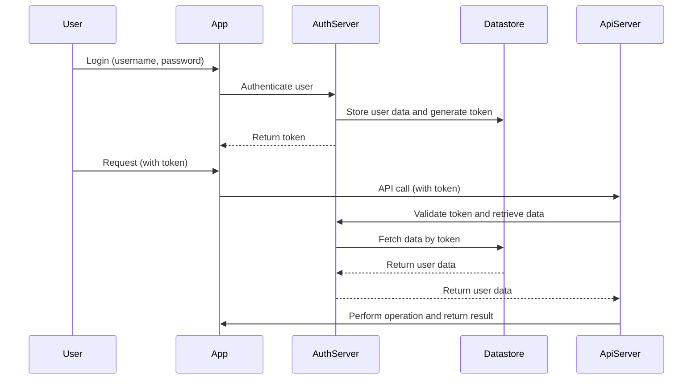
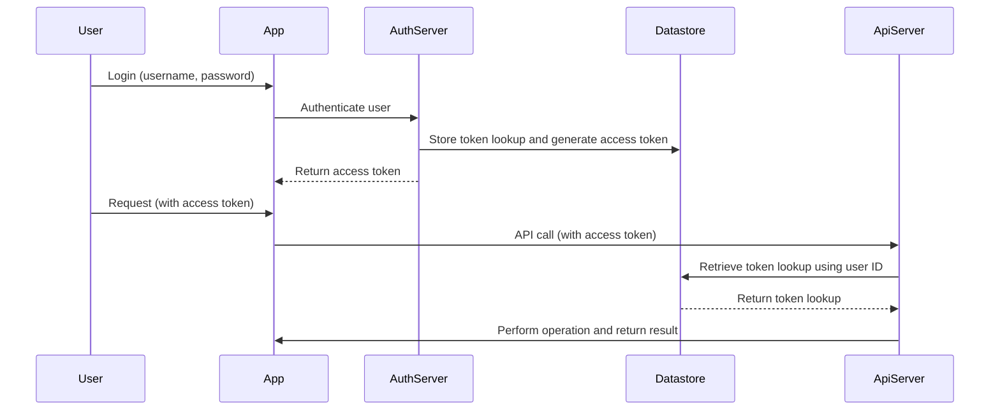
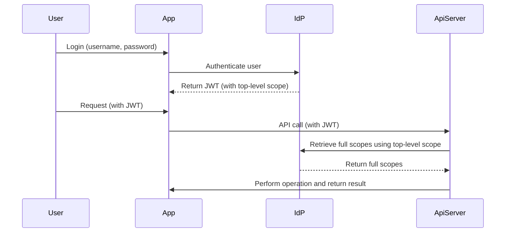

# Map of Contents

- [Map of Contents](#map-of-contents)
- [Identity-scope-exploration](#identity-scope-exploration)
  - [Brief Overview of Scopes for context](#brief-overview-of-scopes-for-context)
  - [Determining and writing scopes](#determining-and-writing-scopes)
  - [Where does scope authorization fit (using DDD as an implementation guide)](#where-does-scope-authorization-fit-using-ddd-as-an-implementation-guide)
  - [Dealing with proliferation of scopes in large domains](#dealing-with-proliferation-of-scopes-in-large-domains)
    - [Technology strategies to mitigate the issue](#technology-strategies-to-mitigate-the-issue)
    - [Structural strategies for scope management](#structural-strategies-for-scope-management)
      - [Option: Using scope hierarchies within subdomains](#option-using-scope-hierarchies-within-subdomains)
      - [Option: Client based scope visibility](#option-client-based-scope-visibility)
  - [Using Scopes in Authorisation](#using-scopes-in-authorisation)
    - [`TBD` Scopes should be tied to data objects than Protocol](#tbd-scopes-should-be-tied-to-data-objects-than-protocol)
      - [Scopes definition in REST and example implementation with Apigee and other.](#scopes-definition-in-rest-and-example-implementation-with-apigee-and-other)
      - [Scopes definition in Graphql and example implementation](#scopes-definition-in-graphql-and-example-implementation)
      - [Scopes definition in gRPC and example implementation](#scopes-definition-in-grpc-and-example-implementation)
  - [GitOps for scope management](#gitops-for-scope-management)
- [Appendix](#appendix)
  - [References](#references)


# Identity-scope-exploration


The goal of this white paper is to build a working strawman that includes a bespoke IDP, APIs, API gateways, and client applications in order to examine potential approaches for leveraging scopes in validation contexts within extensive omni-channel enterprises 

As we navigate through the complexities of OAuth scopes and their management in large organizations, the following North Stars will guide us in writing this white paper:

1. **Code-First Approach**: Advocate for the necessity of a code-first approach, emphasizing the benefits of defining and managing scopes as code. This practice fosters better collaboration, tracking, auditing, and scalability 
   - *Versus spreadsheets and localised manual configuration bound to tools*
   
2. **Continuous Management of Scopes**: Establish the importance of continuous management (<u>*using GitOps*</u>) in large organizations. Detail strategies and mechanisms to maintain and update scopes, with API providers retaining authority to granting access to their API's.
   - *Versus governance forums and councils that decreases fast-flow*

3. **Scalable Systems**: Address the challenges of scope management at scale, exploring how to deal with large numbers of scopes and clients, and suggesting solutions such as scope hierarchies, reference tokens, token splitting, and policy-based claims.

4. **Security and Privacy**: Highlight the significance of maintaining robust security and privacy controls in the scope management process. Discuss how different types of tokens and claims can be used to balance security, performance, and usability. 

5. **Integration with Existing Systems**: Explain how the proposed mechanisms can be integrated with existing systems and workflows, with a particular emphasis on GitOps and IdP-based setups.

6. **Practical Examples**: Provide practical, real-world examples to illustrate each concept and strategy. Make sure each example is relevant to the target audience, focusing on common use cases such as e-commerce and mobile applications.

7. **Performance Considerations**: Discuss performance considerations and potential trade-offs, such as the extra latency involved in reference token validation or scope lookups. Propose potential solutions, such as caching strategies or event-driven updates.

> Note: To keep this paper more objective, will not be touching upon other aspects of tokens such as claims, roles, groups etc. Which could also be used in conjunction with scopes for the purpose of Authorisation.

## Brief Overview of Scopes for context

>

OpenID Connect (OIDC) scopes are used by an application during authentication to authorize access. 

>[!note]  scopes from a user context  on a third party application:
User access' an 3rd party application (say a web or mobile app that can OAUTH login with your email and search and unsubscribe from advertisements).  taking the example of `gmail`
>1.  A user clicks **Login** within your app.    
>2.  Your app redirects the user to the iDP(Identity provider) Server (`/authoriz` endpoint), including the following scopes:    
  > 	-   `openid` (required; to indicate that the application intends to use OIDC to verify the user's identity)
  > 	- `gmail.readonly` To read all resources and metadata
  > 	- `gmail.modify` All read/write operations except immediate, permanent deletion of threads
  > 	- and few other relevant permissions (skipping for TLDR purposes)
>1.  Your idp redirects the user to the login prompt.
>2.  The user authenticates and sees a consent page listing the scopes
>3.  The user accepts and authorizes your app to have this level of access to their information by google iDP
>4.  Your app now has access to the scopes and google's api's on the mailbox will allow for the app to perform the functions (the app calls the google api's the api's check the scopes and authorizes and executes. If scopes were absent, relevant authorization errors entails )

>[!note] Now if User is accessing a first party application
> A first party application are those controlled by the same organization or person who owns the iDP domain.
> There are no changes in the paradigm of scopes application, except that the scopes are pre-assigned on the client app within the identity provider instead of requesting permissions from the user on oauth access.
> As an example the GMAIL app/webapp from google does request user for the scope authorisation as those are pre-configured within googles IDP.


## Determining and writing scopes

Scopes management can be a challenging task in a large organization, particularly when dealing with sensitive data. Here, we consider the scenario of pricing data, specifically distinguishing between selling price and cost price.

1.  **Defining Scopes:** Scopes should be defined based on the roles and responsibilities of clients in the organization. For example, 'read:cost-price' can be defined for clients needing access to cost price, while 'read:selling-price' can be used for clients needing access to the selling price.
    
2.  **Granting Scopes:** Scopes should be granted based on the principle of least privilege. A client should only have the minimum scopes necessary to fulfill its function. For instance, a marketing app might only need 'read:selling-price' scope but not 'read:cost-price' scope.
    
3.  **Managing Scopes:** Scopes should be regularly reviewed and updated based on changes in client responsibilities and data policies. It's also essential to provide clear documentation on what each scope does to prevent misuse.

## Where does scope authorization fit (using DDD as an implementation guide)

Authorization in are typically handled at the application service layer, where most orchestration occurs. Here's how it could be integrated:

1.  **Defining Scopes According to Domain Operations:** Define scopes based on the various operations or tasks that exist within your domain. Each aggregate could potentially have its own set of scopes, defined by the actions that can be performed on it. For instance, for a `Pricing` aggregate, you might have `pricing:read`, `pricing:write`, etc.
    
2.  **Assigning Scopes to Clients:** Assign scopes to clients based on the roles or use cases they have within your domain. For instance, a `Sales` client might be assigned the `pricing:read` scope, but not the `pricing:write` scope.
    
3.  **Checking Scopes During Operations:** When a client attempts to perform an operation on an aggregate, check the client's scopes to see if they're allowed to perform that operation. If they don't have the necessary scope, the operation should fail with an authorization error.
    

> It's important to note that while scopes can give you a high-level authorization control (what type of operations a client can do), they can't provide a granular, data-level control (what specific data within an aggregate a client can operate on). For this type of control, you would likely need additional mechanisms like ACLs (Access Control Lists), ABAC (Attribute-Based Access Control), or RBAC (Role-Based Access Control) on top of your OAuth scopes.

## Dealing with proliferation of scopes in large domains

### Technology strategies to mitigate the issue

In large organisations, the sheer volume of scopes can indeed pose challenges. If not managed properly, it might lead to bloated JWTs exceeding the common maximum size of 8KB. Some technology strategies to mitigate this issue:

-  **Scope Compression:** Create more granular, high-level scopes that encapsulate a range of permissions. This reduces the number of individual scopes required for a client.
    
-  **Use of Policy-Based Claims:** Instead of directly assigning a scope for each fine-grained permission, assign policy-based claims that represent a collection of permissions. This way, the number of claims in a token can be greatly reduced.
	- example difference between a customer and a product manager operating on different channels on the same API.
```
{
  "sub": "C123456",
  "name": "Jane Doe",
  "role": "Customer",
  "policy": "customerPolicy",
  "iat": 1616239122
}

```

```
{
  "sub": "PM789456",
  "name": "John Smith",
  "role": "ProductManager",
  "policy": "productManagerPolicy",
  "iat": 1616239322
}

```
	    
-  **Token Compression:** Another option is to use JWT compression techniques. However, this may increase CPU usage as it requires token compression and decompression. This may not solve the problem if scope assignment crosses thresholds within the IDP
    
-  **Use of Reference Tokens:** Reference tokens store token payloads on the server-side and send a reference ID to the client. When resources are accessed, the server can use the reference ID to lookup the actual token payload, thus bypassing the need to include all the scopes in the token. An example is illustrated below
    


- **Splitting Tokens:** You may also consider splitting the JWT into multiple smaller tokens. Each token will represent a different set of scopes, keeping the size of individual tokens down. An example illustrated below



###  Structural strategies for scope management 

#### Option: Using scope hierarchies within subdomains

One approach to effectively manage a large number of scopes is to introduce a hierarchical design for scopes.

In a hierarchical scope design, scopes are arranged in a tree-like structure, where each node represents a scope. A parent scope encompasses the permissions of all its child scopes. This hierarchy allows a client with a parent scope to have access to the resources of all its child scopes.

Consider our previous pricing example. Suppose you have multiple departments each dealing with different aspects of pricing. A hierarchical scope might look something like:

```yaml
pricing:
    pricing.cost:
        - pricing.cost.read
        - pricing.cost.write
    pricing.selling:
        - pricing.selling.read
        - pricing.selling.write
```
With this hierarchy, a client with the `pricing.selling` scope can read and write selling prices, as it inherits the permissions from the child scopes. This design minimizes the number of scopes a client needs to have, reducing the size of the JWT.


#### Option: Client based scope visibility

In larger organizations, it's essential to have a mechanism to manage and track which clients have access to which scopes. This can become complex when scopes are hierarchicalIt's crucial to ensure that API providers within the organization can easily determine which scopes a client has access to.

>example


```yaml
Mobile:all:
   - pricing:cost
   - pricing:selling:read
```

One approach to managing this complexity is to use an Identity Provider (IdP) that supports scope hierarchies and allows lookup of scopes from the server. This means that when a JWT is issued, it might only contain the top-level scope (Mobile:all), but the associated hierarchical scopes (pricing:cost, pricing:selling:read, etc.) are stored and managed in the IdP.

When an API call is received, the server-side application can contact the IdP with the client's top-level scope to retrieve the full list of associated scopes. It can then check whether the client is authorized to perform the requested operation based on these scopes.

Here's a sequence diagram illustrating this process:



This approach allows the organization to manage complex scope hierarchies in a central place (the IdP) and ensures that API providers can easily determine the full list of a client's scopes. *However, as with reference tokens and token lookups, this method requires an additional step to fetch the full scopes, which could add latency to the API requests. This latency can be mitigated with caching strategies.*

Moreover, it is imperative to maintain an internal document or a database within the organization, listing all the scopes along with their respective access details. This will provide a quick lookup for the API providers to know which clients have access to which scopes.

>***A more detailed exploration of how to optimise latency in different implementations of API's and API gateways(e.g: apigee) is in the [appendix]()***


## Using Scopes in Authorisation

### `TBD` Scopes should be tied to data objects than Protocol

>**TBD**

</br>

#### Scopes definition in REST and example implementation with Apigee and other.


>**TBD**

</br>

#### Scopes definition in Graphql and example implementation

One way to control access to resources at a field level is through the use of custom directives.A directive is a way of decorating part of your schema, or the data returned by it, with additional functionality. For example, you could define a `@hasScope` directive that checks if the requesting user has the required scope to access a particular field.

Here is an example of how a GraphQL schema for a Price type might look like, including the use of a `@hasScope` directive for scope validation:

```graphql
directive @hasScope(scope: [String]) on FIELD_DEFINITION

type Price {
  costPrice: Float @hasScope(scope: ["Pricing.cost.read"])
  sellPrice: Float @hasScope(scope: ["Pricing.sell.read"])
}

type Query {
  getPrice(productId: ID!): Price @hasScope(scope: ["Pricing.read"])
}
```

In this example, the `@hasScope` directive is used to annotate the `costPrice` and `sellPrice` fields of the `Price` type, as well as the `getPrice` query. The directive takes a `scope` argument which is an array of the required scopes for accessing the annotated field.

The logic for the `@hasScope` directive would be implemented on the server, where it would check the `scope` claim of the incoming request's JWT against the required scopes specified in the directive's argument. If the JWT contains all the required scopes, the request is allowed, otherwise, an error is returned.

>example excerpt of validating scope using a python gql server

```python
from graphql import (
    default_field_resolver,
    DirectiveLocation,
    GraphQLDirective,
    GraphQLString,
    GraphQLList,
    GraphQLField,
    GraphQLObjectType,
    GraphQLSchema,
    GraphQLArgument,
)

class HasScopeDirective:
    def __init__(self, required_scopes):
        self.required_scopes = required_scopes

    def has_scope(self, resolver, root, info, **args):
        # Get the actual scopes from the JWT.
        actual_scopes = info.context.get('scopes', [])

        # Check if all required scopes are present in the actual scopes
        for required_scope in self.required_scopes:
            if required_scope not in actual_scopes:
                raise Exception('Insufficient scopes')

        return resolver(root, info, **args)

def has_scope_directive(resolver=default_field_resolver, obj=None, info=None, **args):
    required_scopes = args.get('scope', [])
    directive = HasScopeDirective(required_scopes)
    return directive.has_scope(resolver, obj, info, **args)

# Define the @hasScope directive
hasScopeDirective = GraphQLDirective(
    name='hasScope',
    locations=[DirectiveLocation.FIELD_DEFINITION, DirectiveLocation.OBJECT],
    args={
        'scope': GraphQLArgument(GraphQLList(GraphQLString)),
    }
)

# You would define your types and fields like this
priceType = GraphQLObjectType(
    "Price",
    lambda: {
        "costPrice": GraphQLField(
            GraphQLString,
            resolver=has_scope_directive,
            directives=[hasScopeDirective]
        )
    },
)

# Add the directive to your schema
schema = GraphQLSchema(query=priceType, directives=[hasScopeDirective])
```

For full working model look at [fizzbuzz](./fizzbuzz-gql/)


#### Scopes definition in gRPC and example implementation

>**TBD**
</br>

## GitOps for scope management

One effective way to manage and track the changes to these scopes is to store them in a version control system, creating an audit trail of changes and a single source of truth.

To facilitate this, we can store scopes in configuration as YAML or JSON. These configuration files can then be committed to a Git repository, enabling us to leverage the benefits of using [gitops](#gitops) for scope management.


**Here's a high-level example overview of how this process works with a trunk based gitflow:**

1. **Scope Definition**: Each scope required for APIs is defined within its configuration file (YAML/JSON). This can be broken down by API provider, allowing granular control and responsibility.
2. **CODEOWNERS**: Each configuration file is protected by relevant codeowners (API providers), who would be the custodian of access control for their API.

3. **Commit/ Push/ PR**: The configuration files are committed and pushed to a Git repository and a Pull Request is raised. Any changes to the scopes must be done via Git, ensuring an audit trail of changes. And will always require CODEOWNERS approval.

4. **Automated Linting and Validation**: An automated process (CI pipeline) is triggered on every change, which performs linting and validation on the configuration files. This helps to ensure consistency and correctness in the scope definitions. Nomenclature and other custom variations of standards can be validated for every change in the PR and fail/pass as appropriate

5. **Scope Deployment**: Upon successful validation and approval from CODEOWNERS, the PR is automatically merged and the scopes can be updated in the identity provider, completing the GitOps cycle.

By using this approach, scope management becomes more controlled, transparent, and auditable. It ensures that changes are validated and reviewed, reducing the risk of errors, and facilitating a more secure and organized management of API access.


>examples

- pricing

```yaml
Pricing.cost:
  - mobile.org
  - inventory.management
Pricing.cost.read:
  - webspa.digital
  - sales.dashboard
Pricing.cost.write:
  - admin.backend
Pricing.sell:
  - mobile.org
  - webspa.digital
Pricing.sell.read:
  - sales.dashboard
Pricing.sell.write:
  - admin.backend

```

- inventory

```yaml
Inventory.all:
  - mobile.org
  - webspa.digital
Inventory.read:
  - sales.dashboard
  - inventory.management
Inventory.write:
  - admin.backend
Inventory.stocklevel:
  - mobile.org
  - sales.dashboard
Inventory.stocklevel.read:
  - inventory.management
Inventory.stocklevel.write:
  - admin.backend

```

- order management
  
```yaml
Order.all:
  - admin.backend
Order.read:
  - webspa.digital
  - sales.dashboard
Order.write:
  - mobile.org
Order.status:
  - mobile.org
  - webspa.digital
Order.status.read:
  - sales.dashboard
Order.status.write:
  - admin.backend

```

The design of managing scopes as provider-focused is premised on the intention to vest the full control of API accessibility in the hands of the API providers. Each YAML file, corresponding to a particular API provider, outlines the allocation of scopes to various clients.

This approach is significantly beneficial as it allows us to leverage a feature like CODEOWNERS. The CODEOWNERS file is a mechanism of GitLab that defines the individuals or teams responsible for the code in a project. By this means, each scope assignment YAML file can have its designated "owner," ensuring that the corresponding API provider retains authority over their API's access.

This setup not only ensures accountability but also streamlines the review and approval process for changes to scope assignments. Any alterations proposed, such as via a pull request, can be directly routed to the appropriate API provider for review, ensuring they have a say on who gets access to their API.

The GitOps pipeline would flip this hierarchy as maintained by code into the hierarchy that would appear in the JWT token. Illustrated as a `yaml` example (just to depict how it would reflect in the identity provider)

```yaml
mobile.org:
  - Pricing.cost
  - Pricing.sell
  - Inventory.all
  - Inventory.stocklevel
  - Order.write
  - Order.status

webspa.digital:
  - Pricing.cost.read
  - Pricing.sell
  - Inventory.all
  - Order.read
  - Order.status

sales.dashboard:
  - Pricing.cost.read
  - Pricing.sell.read
  - Inventory.read
  - Inventory.stocklevel
  - Order.read
  - Order.status.read

inventory.management:
  - Pricing.cost
  - Inventory.read
  - Inventory.stocklevel.read

admin.backend:
  - Pricing.cost.write
  - Pricing.sell.write
  - Inventory.write
  - Inventory.stocklevel.write
  - Order.all
  - Order.status.write

```

For more details look in the [scope-catalogue](./scope-catalogue) folder

# Appendix

## References

<a name="gitops"></a> **Gitops** - it leverages Git as a single source of truth for declarative infrastructure and applications. With the scopes defined in code and stored in a Git repository, it's possible to apply the same practices to scope management.